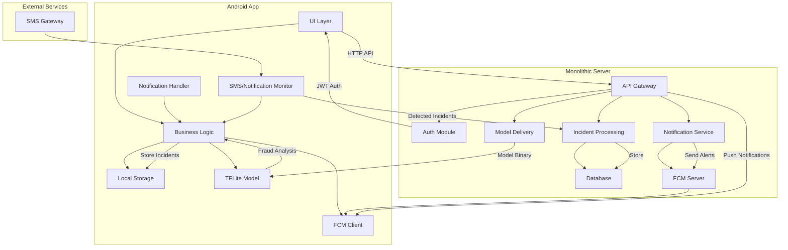
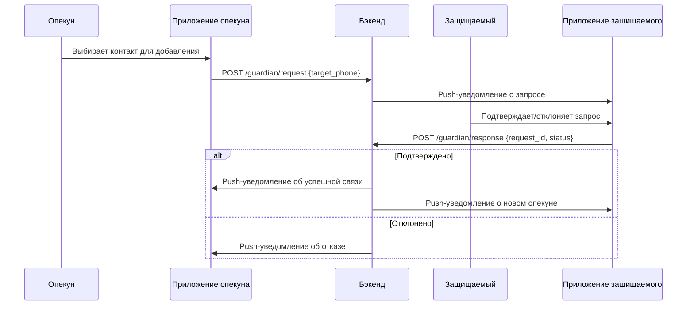
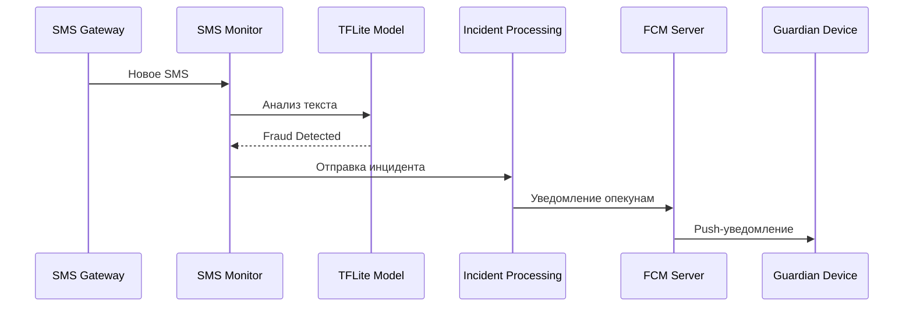
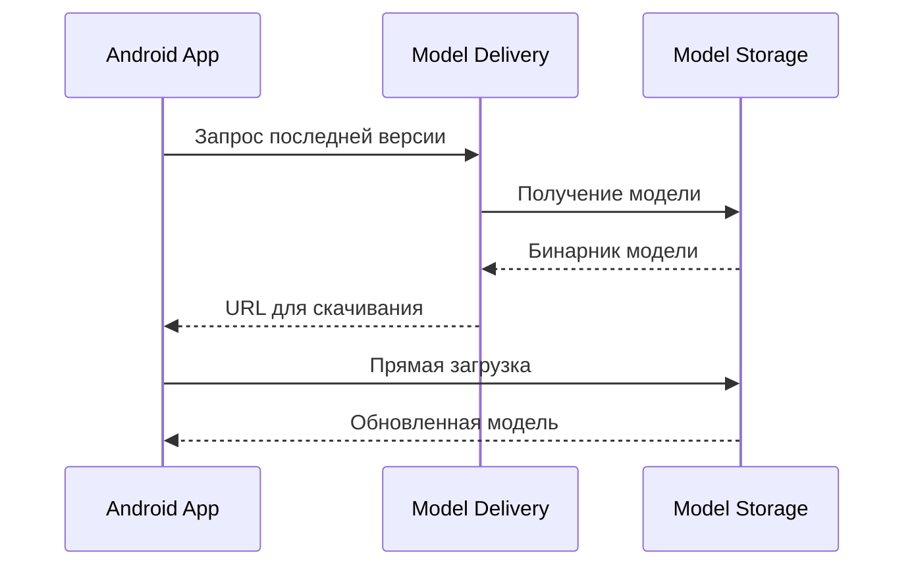
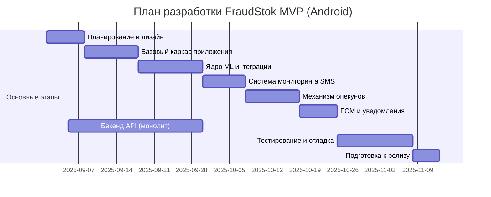

# FraudStok - мобильное антифрод приложение.

### Основные бизнес требования к системе:
* ML On device архитектура,
* требования к ML модели:
  * сверточная нейросесть,
  * размер одной модели не более 10Мб;
  * адаптивность для использования на мобильных устройства (Tensorflow lite)
* Платформа приложения - Android,
* Функционал версий MVP:
  * v1 - обнаружение финансового скама,
  * v2 - детекция буллинга,
  * v3 - вымогательства.
* отправка уведомлений при обнаружении инцидента.
* простота разработки, масштабируемость системы и функционала.
* шифрование и хеширование используемой локально информации для предотвращения подмены критически важных данных.

# v1 implementation:
### Терминология:
* `жертва`, `подопечный` - пользователь, на устройстве которого приложение осуществляет
детекцию неправомерных событий,
* `инцидент` - неправомерное событие причиняющее вред жертве.
* `опекун` - пользователь, получающий уведомления об инцидентах на устройстве
жертвы.
* `уведомление` - push уведомление от приложения.
* `сканирование` - процесс анализа целевой информации ML моделью (SMS, уведомления)
* `FCM` - (Firebase Cloud Messaging) сервер рассылки уведомлений.
* `S3` - облачное хранилище файлов.
* `вектор сканирования` - определенный набор или последовательность информации или признаков устройства подвергаемые анализу ML модели.

### компоненты системы:
- *мобильное приложение* - мобильное android приложение предоставляющее полный доступ к функциональным возможностям,
- *ML модель* - обученная под конкретную задачу ML модель запускаемая приложение для детекции инцидентов,
- *функциональный сервер* - сервер предосталвяющий приложению пользователя возможность: выполнить регистрацию в системе, пройти авторизацию и аутентификацию, загрузить или обновить используемую ML модель, отправить уведомление об инциденте.
- *сервер рассылки уведомлений* - сервер рассылки уведомлений принимающий запросы от основного функционально сервера.
- *облачное хранилище файлов* - содержит все используемые приложением ML модели (разработка, тестирование и продакшн)

### UserStories:

#### Регистрация в системе:
1) пользователь загружает приложение и разрешает доступ приложению к SMS и уведомлениям.
2) пользователь вводит номер телефона и подтверждает его вводом пятизначного кода (подтверждение по SMS через сервер),
3) пользователь успешно подтверждает номер телефона и вносит необходимые персональные данные (сохраняется на сервер),

**Ожидаемый результат**: пользователь вошел в приложение и ему доступен весь требуемый функционал.

### Запуск сканирования для себя (жертва = опекун)
1) пользователь успешно прошел авторизацию / аутентификацию,
2) пользователь нажимает в интерфейсе приложения кнопку начать сканирование.
3) приложение запускает необходимый цикл сканирования по выбранному вектору Финансовый скам: SMS и уведомления.

**Ожидаемый результат**: приложение выполняет сканирование в фоновом режиме: пользователь может закрыть телефон или перейти в другое приложение
без остановки сканирования.

### Остановка сканирования для себя (жертва = опекун)
1) пользователь успешно прошел авторизацию / аутентификацию,
2) пользователь открывает приложение и нажимает кнопку остановки сканирования.

**Ожидаемый результат**: приложение остановило цикл сканирования и больше не выполняет никаких фоновых оперций.

### Уведомление об инциденте (жертва = опекун)
1) пользователь успешно прошел авторизацию / аутентификацию,
2) пользователь не держит приложение открытым,
3) мобильный телефон получает SMS или уведомление с потенциально опасным контентом,

**Ожидаемый результат**: фоновый процесс сканирования проанализировал содержимое сообщения и создал локальное push уведомление об угрозе для
пользователя.

### Просмотр истории инцидентов (жертва = опекун)
1) пользователь успешно прошел авторизацию / аутентификацию,
2) пользователь открыл приложение и выбрал раздел истории,

**Ожидаемый результат**: пользователю доступна вся история инцидентов на нынешнем устройстве c детальной
конфиденциальной информацией

### Добавление жертвы (пользователь = опекун)
1) пользователь успешно прошел авторизацию / аутентификацию,
2) пользователь выбрал раздел добавления подопечного,
3) пользователь указал телефонный номер целевого пользователя зарегистрированного в системе и отправил запрос,
4) сервер принял запрос от приложения пользователя опекуна и направил уведомление о запросе целевому подопечному.
5) пользователь подопечный получил уведомление и подтвердил запрос от опекуна.
6) приложение добавило пользователя опекуна в список разрешенных для подопечного и обновило информацию на сервере.

**Ожидаемый результат**: при возникновении инцидента приложение отправляет уведомление о потенциальной опасности
опекуну и подопечному.

### Просмотр истории инцидентов (пользователь = опекун)
1) пользователь успешно прошел авторизацию / аутентификацию,
2) пользователь выбрал раздел истории и открыл инциденты конкретного опекуна.
3) приложение опекуна запросило базовую допустимую информацию об инцидентах жертвы для пользователя

4) **Ожидаемый результат**: опекун увидел историю скана конкретного опекуна без чувствительных конфиденциальных данных.

### Удаление опекуна (пользователь = жертва)
1) пользователь успешно прошел авторизацию / аутентификацию,
2) пользователь открыл раздел опекунов и удалил выбранного пользователя из списка,
3) сервер принял запрос и обновил информацию,

**Ожидаемый результат**: удаленный из списка опекунов пользователь больше не получает уведомления об инцидентах опекуна.

## Функциональная реализация
1) Общая схема взаимодействия компонентов

Приложение содержит:
* обновляемую через server ML модель,
* пользовательский UI,
* FCM клиент для входящий уведомлений,
* локальную базу данных,
* фоновый процесс обработки инцидентов (бизнес логика)

Сервер (монолит) содержит:
* Слой API для сетевого взаимодействия,
* Сервис регистрации и авторизации,
* сервис обработки уведомлений в рамках инцидентов
* FCM адаптер для отправки уведомлений

2) Добавление опекуна:

3) обнаружение инцидента

4) обновление ML моделей:

## разработка 

### Оценка времени 

### Детализация

Подготовительный этап (40-50 часов)
* Технический анализ требований 
* Дизайн архитектуры 
* Подбор ML модели (доработка существующей или обучение новой)
* Прототипирование UI/UX

Базовый каркас приложения (120-150 часов)
* Настройка Android проекта 
* CI/CD pipeline 
* Основные экраны приложения 
* JWT-авторизация 
* Локальное хранилище (Room или Sqlite)

ML интеграция (80-100 часов)
* Адаптация TF Lite модели под Android 
* Оптимизация модели (<10MB)
* Разработка препроцессинга текста 
* Тестирование точности на реальных данных

Мониторинг SMS (60-80 часов)
* Интеграция с SmsRetriever API 
* Обработка системных уведомлений 
* Фоновый сервис мониторинга 
* Безопасное хранение данных

Система опекунов (90-120 часов)
* Механизм запросов/подтверждений 
* Синхронизация контактов 
* Управление списками 
* Валидация номеров телефонов

Уведомления (50-70 часов)
* Интеграция FCM 
* Групповые уведомления 

Бекенд разработка (140-180 часов)
* Монолитный API (Python/Fastapi)
* Model Delivery Service 
* Incident Management 
* Аутентификация 
* База данных (PostgreSQL)

Тестирование (100-150 часов)
* Юнит-тесты 
* Интеграционное тестирование 
* Тестирование на реальных устройствах 
* Penetration testing 
* Оптимизация производительности 
* Релизная подготовка (30-50 часов)
* Документация 
* Настройка аналитики 
* Политика конфиденциальности

### Общий диапазон: 700-900 часов
### Консервативная оценка (с учетом рисков): ~1000 часов
Предоставлена наиболее критичная оценка времени, распределение по ролям может быть сокращено
в зависимости от итогового согласованного функционала и спроектированной системы.

## Условное распределение по ролям
- Android разработчик: 400-500 часов
- Бекенд разработчик: 200-250 часов
- ML инженер: 80-120 часов
- QA инженер: 100-150 часов
- Дизайнер/Аналитик: 50-80 часов

Факторы, влияющие на сроки
Сокращают время:
- Готовая ML модель,
- Использование boilerplate кода или ai,

Увеличивают время:
- Необходимость дообучения модели,
- тестирование разных кейсов для модели,
- Сложности с SMS мониторингом на разных моделях телефонов.
- выявление дополнительные требования к безопасности.

# v2 implementation:
Важно: правильная системная архитектура и дизайн приложения позволят существенно сокраиить
время на добавление новых полезных функций в приложение. С учетом архитектурного решения версии 1 и требованиям ко второй версии
приложения, которые подразумевают только добавление новых векторов сканирования, реализация может занять более короткое время, нежели разарботка
первой основной версии. В данном случае основные ресурсы нужно будет сконцентрировать на разработке ML моделей под разные кейсы, необходимые для обучения данные и тестирование.
Все необходимые модели будут подгружаться в приложение без необходимости выпускать новые релиз, а интерфейс будет готов обрабатывать любые разнообразные 
инциденты и уведомления.

